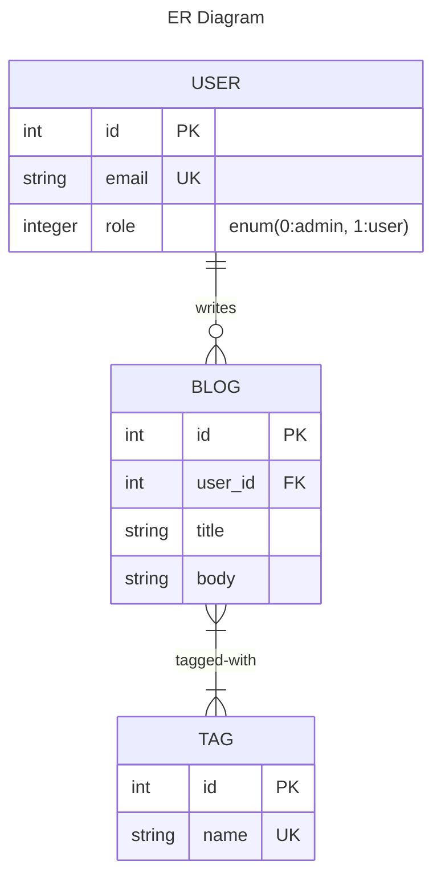

# README

This README would normally document whatever steps are necessary to get the
application up and running.

Things you may want to cover:

* Ruby version

* System dependencies

* Configuration

* Database creation

* Database initialization

* How to run the test suite

* Services (job queues, cache servers, search engines, etc.)

* Deployment instructions

Steps to run the final project:

1-yarn add typescript --dev
2-rails db:migrate
3-rails db:seed
4-open local on the browser and run pending migrations
5-run the test cases
